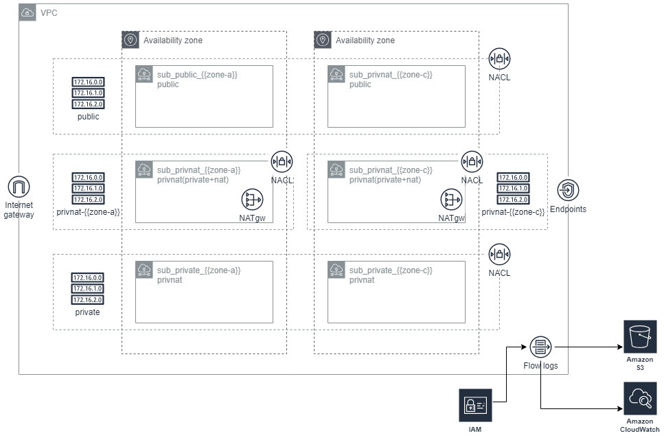

# AWS VPC Catalog

AWS Virtual Private Network를 구성하는 Catalog입니다.  AWS network 구성요소 중, VPC, subnet, route table, internet gateway, nat gateway, nat gateway용 eip, network acl 등을 구성하게 됩니다.  본 VPC Catalog는 네트워크를 크게 public(외부와 inbound/outbound 인터넷 통신 가능), private-nat(private zone이나 outbound 인터넷 통신이 가능), private(외부와의 통신 단절) 3가지로 구성할 수 있으며, 기본 2개 이상의 availability zone을 구성하여, 장애에 대비하는 아키텍처를 구성합니다.

✔  [`AWS VPC`](https://docs.aws.amazon.com/ko_kr/vpc/latest/userguide/what-is-amazon-vpc.html) - Amazon Virtual Private Cloud(Amazon VPC)를 이용하면 사용자가 정의한 가상 네트워크로 AWS 리소스를 시작할 수 있습니다. 
이 가상 네트워크는 의 확장 가능한 인프라를 사용한다는 이점과 함께 고객의 자체 데이터 센터에서 운영하는 기존 네트워크와 매우 유사합니다. 

## 아키텍처 구성도

## Input variables

AWS VPC catalog 사용에 필요한 Input variables 입니다.  세부적인 내용은 Gitops Console의 Variable 입력창의 도움말을 통해 확인 할 수 있습니다.

|       name        |  type  | required |                        description                         |
| :---------------: | :----: | :------: | :--------------------------------------------------------: |
|      project      | string |   yes    |                project name or service name                |
|       stage       | string |   yes    |         service stage of project (dev, stg, prod)          |
|      region       | string |   yes    |              region name to create resources               |
|    region_code    | string |   yes    |                  country code for region                   |
|    cidr_block     | string |   yes    |                 network CIDR block for VPC                 |
|      subnets      |  map   |   yes    |                  VPC subnet configuration                  |
|       nacls       |  map   |    no    |           network security group rule definition           |
|     endpoints     |  map   |    no    | gateway and interface type vpc endpoint service definition |
|  enable_flowlog   |  bool  |    no    |                   enable network flowlog                   |
| flowlog_retention | number |    no    |   retention in days for cloudwatch log group of flowlog    |

## Output variables

AWS VPC catalog 사용 후 결과값에 대한 output variables 입니다. 세부적인 내용은 Gitops Console의 Variable 입력창의 도움말을 통해 확인 할 수 있습니다.

|       name       |  type  |                         description                          |
| :--------------: | :----: | :----------------------------------------------------------: |
|        id        | string |                            VPC id                            |
|    subnet_ids    |  map   |    vpc subnet id map (key: subnet name, value: subnet id)    |
|     rtb_ids      |  map   | vpc route table id map (key: subnet name, value: route table id) |
| natgw_public_ips |  map   | nat gateway public ip address map (key: eip name, value: natgw public ip) |
|    natgw_ids     |  map   |     nat gateway ID map (key:  eip name, value: natgw id)     |
|     nacl_ids     |  map   | network security group id map (key: nacl name, value: nacl id) |